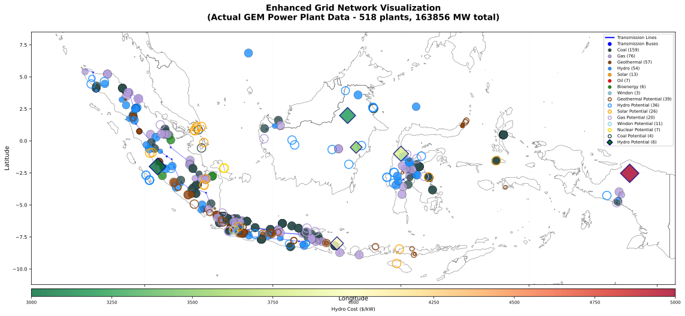
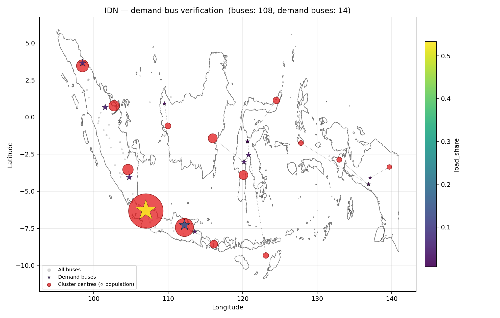
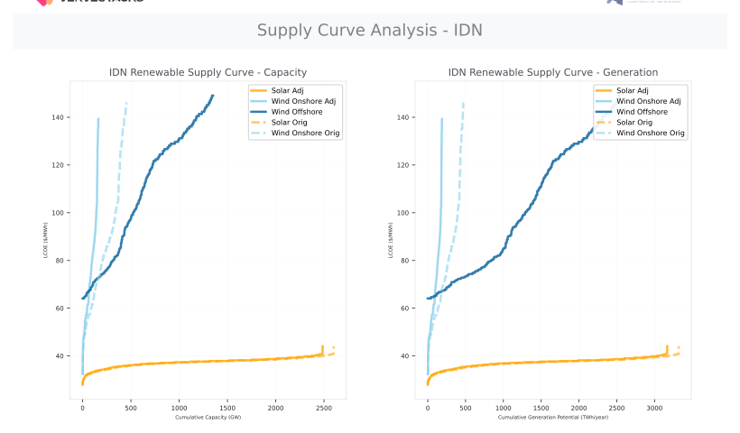
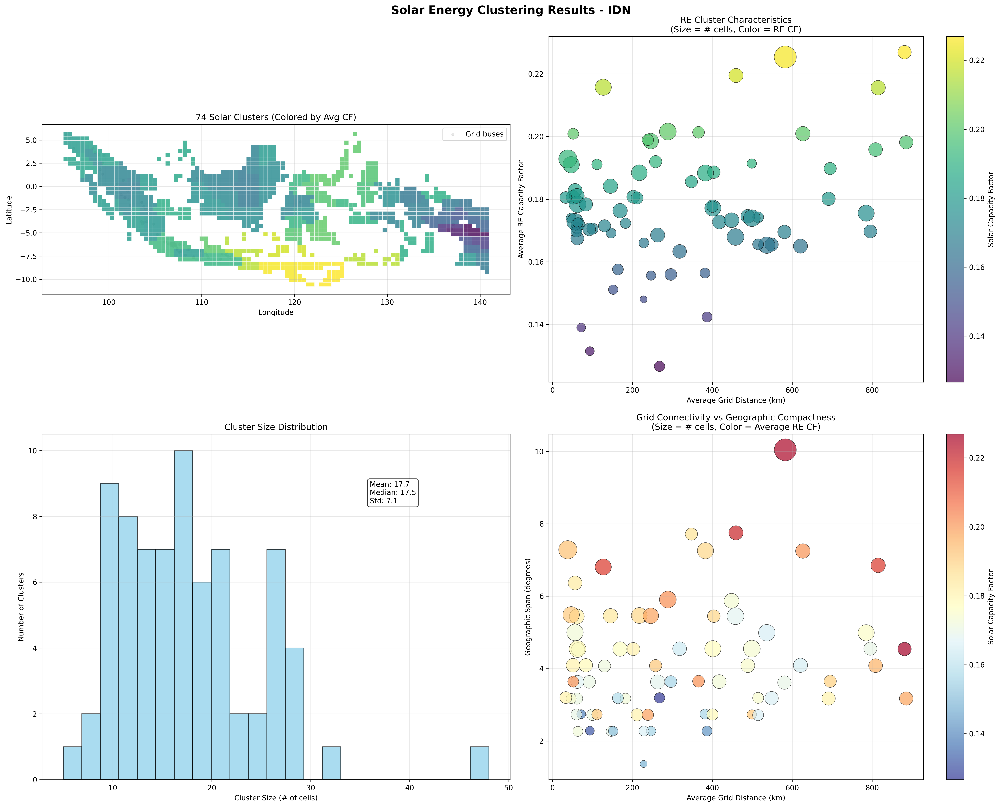
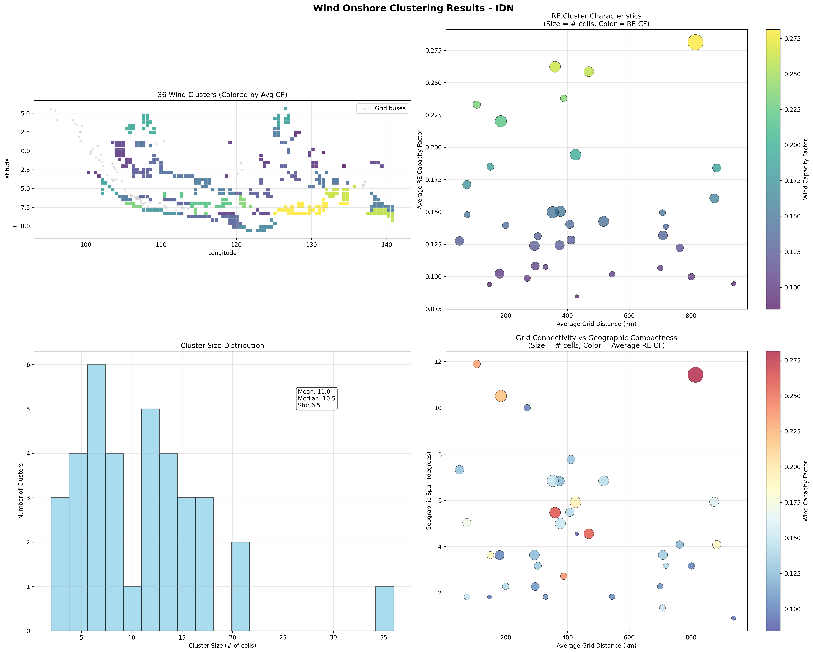
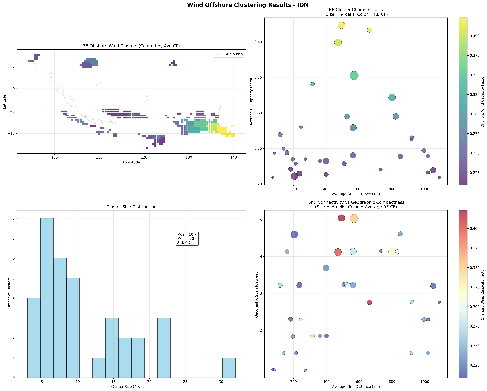
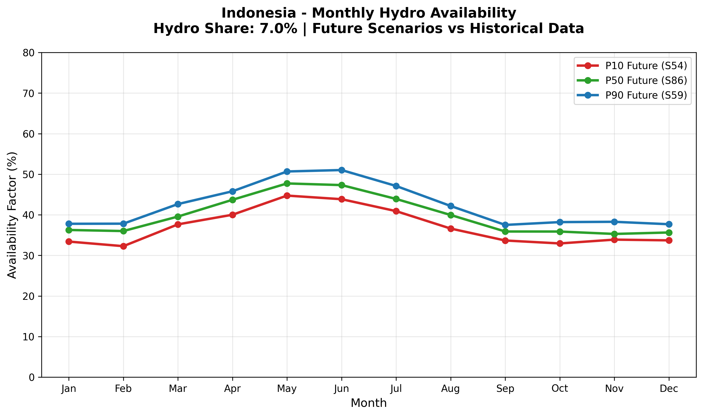
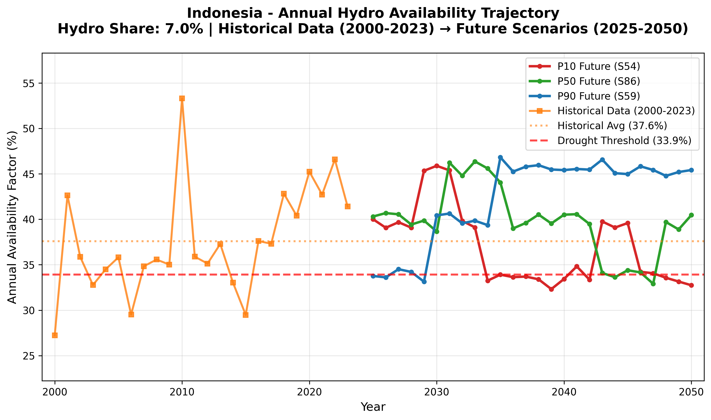
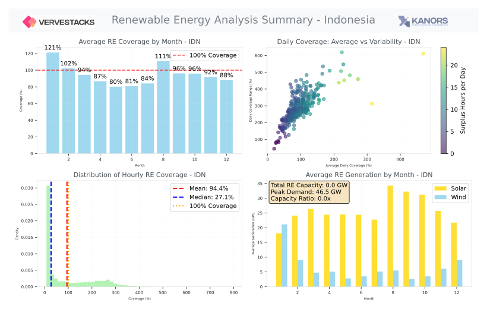
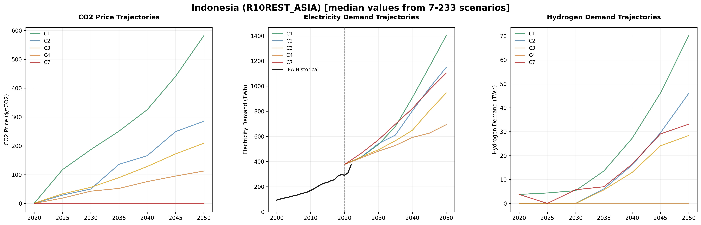

# VerveStacks Model Generation Notes - IDN
**Generated:** 2026-05-08 16:47:00

## Model Calibration 2022

| **Total Capacity** | **Total Generation** | **CO2 Emissions** | **Calibration to EMBER** |
|--------------|---------------|------------|--------------------------|
| 81 GW | 334 TWh | 225 Mt | 100% |

**Note:** 2022 fossil and bio capacity is calibrated to EMBER and renewable capacities to IRENA. UNSD has incomplete data for fuel consumption, so the calibration is demonstrated against the total CO2 emission reported by EMBER. This shows that the efficiency assumptions are good.

## Power Generation Assets

### Existing Capacity

| **Fuel Type** | **Threshold** | **Plants Above Threshold** | **Active Capacity** | **Mothballed Capacity** | **Wtd Avg Efficiency** |
|---------------|---------------|----------------------------|--------------------|--------------------------|-----------------|
| 🌱 **Bioenergy** | 50 MW | 5/6 plants | 3.98 GW | — | 31% |
| ⚫ **Coal** | 140 MW | 153/211 plants | 63 GW | — | 36.2% |
| 🔥 **Gas** | 140 MW | 57/85 plants | 26 GW | 0.145 GW | 47.8% |
| 🌋 **Geothermal** | 10 MW | 55/57 plants | 3.19 GW | — | 100% |
| 💧 **Hydro Power** | 10 MW | 53/53 plants | 9.26 GW | — | 89% |
| 🛢️ **Oil** | 140 MW | 3/7 plants | 0.865 GW | — | 31.8% |
| ☀️ **Solar** | 200 MW | 0/22 plants | 0.678 GW | — | 96% |
| 💨 **Windon** | 200 MW | 0/3 plants | 0.157 GW | — | 100% |
| 🔋 **Pumped Storage** | 10 MW | 1/1 plants | 1.04 GW | — | 100% |

### Future Projects (offered for endogenous selection)

| **Fuel Type** | **Threshold** | **Plants Above Threshold** | **Total Capacity** | **Wtd Avg Efficiency** |
|---------------|---------------|----------------------------|--------------------|-----------------|
| ⚫ **Coal** | 140 MW | 4/4 plants | 4.86 GW | 34.5% |
| 🔥 **Gas** | 140 MW | 16/20 plants | 9.16 GW | 49.2% |
| 🌋 **Geothermal** | 10 MW | 39/39 plants | 2.78 GW | 100% |
| 💧 **Hydro Power** | 10 MW | 33/33 plants | 14.6 GW | 100% |
| ⚛️ **Nuclear** | — | 7/7 plants | 3.5 GW | 100% |
| ☀️ **Solar** | 200 MW | 18/26 plants | 16.5 GW | 100% |
| 💨 **Windon** | 200 MW | 3/12 plants | 1.52 GW | 100% |
| 🔋 **Pumped Storage** | 10 MW | 3/3 plants | 2.4 GW | 100% |

Announced and pre-construction projects are offered as options to the model for endogenous investment. This is particularly useful for hydro and pumped storage as country-wise potential is not readily available. We also get grid locations of all these units.

### 🔄 CCS Retrofit Potential
| **Fuel Type** | **Retrofit Host Capacity** | **Retrofit Potential Capacity**
|---------------|----------------------------|-------------------------------|
| ⚫ **Coal** | 63 GW | 42.8 GW after capacity penalty |
| 🔥 **Gas** | 26.2 GW | 22.1 GW after capacity penalty |

## Data, Assumptions & Coverage

### Primary Data Sources

#### Base-Year Power Plant Specifications
- **Global Energy Monitor (GEM)** [🌐](https://globalenergymonitor.org)  
  Open-access database of individual power plants worldwide, including location, capacity, fuel type, commissioning year, and technical specifications.
- **International Renewable Energy Agency (IRENA)** [🌐](https://www.irena.org/Statistics)  
  Global renewable energy capacity and generation statistics (2000–2022), disaggregated by country and technology.
- **EMBER Climate** [🌐](https://ember-climate.org/data/)  
  Global dataset tracking electricity generation, installed capacity, and emissions intensity (2000–2022).

#### Enhanced Renewable Energy Characterization
- **GEM-REZoning-Atlite Integration** [`re_units_cf_grid_cell_mapping.csv`]  
  Enhanced renewable energy units with capacity factors from Atlite weather data and precise grid cell locations from REZoning database. This integration provides spatially-resolved capacity factors for existing renewable plants, enabling accurate performance modeling and grid cell assignment for spatial optimization.
- **Capacity Factor Enhancement**: Individual renewable plants receive location-specific capacity factors derived from 2013 hourly weather patterns
- **Spatial Grid Assignment**: Plants mapped to 50x50km REZoning grid cells for consistent spatial modeling

### Data Processing Notes
- **Individual Plant Coverage**: 95% of total capacity from plant-level GEM data
- **Total Capacity Tracked**: 164 GW from all sources
- **Plants Above Threshold**: 399 individual plants tracked
- **Total Plants Processed**: 589 plants in database
- **Missing Capacity Added**: - **IRENA data**:
  - **hydro**: 1.49 GW
  - **geothermal**: 0.05 GW

## Model Structure

### Files Included
- **Source Data**: `source_data/VerveStacks_IDN.xlsx` - the full dataset in a model-agnostic format
- **VEDA Model Files**: Complete model ready for Veda-TIMES execution
- **Scenario Files**: AR6 climate scenarios and policy assumptions

## Grid Network Visualization

### 🗺️ **Grid Network Overview**

This model includes a **comprehensive grid visualization** showing the complete transmission infrastructure and renewable energy integration:

  
  
<em>🗺️ Grid network showing transmission infrastructure, power plants, and renewable energy zones</em>

**What you can explore:**
- **Transmission Network**: High-voltage lines and substations from real grid data
- **Power Plant Locations**: Actual generating facilities mapped to grid buses
- **Renewable Energy Zones**: 50×50km grid cells with solar/wind potential
- **Load Centers**: Demand distribution across the network
- **Grid Constraints**: Bottlenecks and transmission limitations

### Grid Topology Statistics

#### 📊 **Transmission Infrastructure**

| **Metric** | **Value** | **Description** |
|------------|-----------|-----------------|
| **Total Buses** | 108 | Transmission substations and connection points |
| **Transmission Lines** | 125 | High-voltage transmission corridors |

#### ⚡ **Power Plant Integration**

| **Integration Type** | **Count** | **Total Capacity** | **Description** |
|---------------------|-----------|-------------------|-----------------|
| **Plants Mapped to Buses** | 350 | None GW | GEM power plants assigned to grid locations |

### Spatial Resolution & Renewable Zones

#### 🗺️ **High-Resolution Grid Modeling**

This model employs **50×50km spatial resolution** for detailed renewable energy analysis:

| **Spatial Metric** | **Value** | **Technical Detail** |
|-------------------|-----------|---------------------|
| **Grid Cells** | 4360 | 50×50km renewable energy zones |
| **Solar/Wind Onshore Zones** | 1450 | Grid cells with solar and onshore wind potential |
| **Wind Offshore Zones** | 2910 | Grid cells with offshore wind potential |
| **Zone-Bus Mappings** | 4360 | REZoning zones assigned to transmission buses |

#### 🔌 **Spatial Commodity System**

Each grid cell generates location-specific electricity commodities:
- **Solar**: `elc_spv_<ISO3>_<cluster_id>`
- **Wind Onshore**: `elc_won_<ISO3>_<cluster_id>`
- **Wind Offshore**: `elc_wof_<ISO3>_<cluster_id>`

This enables **grid-aware optimization** where renewable generation is constrained by:
- Transmission capacity between zones
- Grid stability requirements
- Spatial resource quality variations
- Inter-zone electricity trade opportunities

### Load Distribution Analysis

#### 🗺️ **Demand-to-Bus Mapping**

Electricity demand shares are distributed across the transmission network using
**demand-region clustering** with nearest-bus assignment:

| **Load Distribution Method** | **Buses with Load** | **Total Load Share** | **Methodology** |
|------------------------------|---------------------|---------------------------|-----------------|
| **Demand-Region Clustering** | 14 | 1.0 | Population-weighted clusters mapped to nearest buses |

#### 📈 **Load Concentration Analysis**

- **Highest Load Bus**: way/926254403-500 (0.533 share)
- **Load Distribution CV**: 185.8% (coefficient of variation)
- **Load Balancing**: Highly concentrated demand on a small set of buses

This spatial load distribution enables **realistic grid modeling** where:
- Electricity demand shares vary by location
- Transmission constraints affect supply-demand balancing
- Grid bottlenecks impact renewable integration
- Regional electricity trade opportunities are identified

### Technical Implementation

#### 🔬 **Grid Processing Methodology**

Four data layers are integrated onto a common transmission bus topology: processed OSM-based high-voltage network data from the PyPSA-Eur pipeline (Xiong et al. 2025), REZoning renewable zones at 50×50km resolution, GEM power plant locations, and population-weighted demand-region clusters.

*→ [Grid processing pipeline details](../docs/METHODOLOGY_DOCUMENTATION.md#grid-processing-pipeline)*

#### 🎯 **Model Capabilities**

This grid modeling enables:
- **Transmission Constraint Analysis**: Identify grid bottlenecks and expansion needs
- **Renewable Integration Studies**: Optimize renewable deployment considering grid limits
- **Inter-Regional Trade**: Model electricity exchange between grid zones
- **Grid Stability Assessment**: Analyze system stability with high renewable penetration
- **Investment Planning**: Identify optimal transmission and generation investments

## Renewable Energy Characterization

VerveStacks provides comprehensive renewable energy potential analysis at unprecedented spatial resolution, 
combining global resource assessments with realistic deployment constraints to deliver actionable insights 
for energy system planning.

### **Data Foundation: REZoning Integration**

Our renewable energy characterization builds on the REZoning database, providing detailed potential 
assessments at 50×50 km grid resolution across 190+ countries. This high-resolution spatial data 
captures the nuanced variations in renewable energy resources that are critical for accurate energy 
system modeling.

**Data Sources:**
- **Solar Potential**: REZoning solar resource data with capacity factors and LCOE estimates
- **Wind Onshore**: REZoning onshore wind potential with economic viability assessments  
- **Wind Offshore**: REZoning offshore wind resources with marine-specific constraints
- **Hourly Profiles**: Atlite-derived capacity factor time series for each grid cell

### **Land Use Conflict Resolution: Conservative Overlap Management**

Where solar and wind potential overlaps, VerveStacks applies a conservative LCOE-based allocation: the less competitive technology receives a reduced share of the overlapping area. This ensures supply curves represent **deployable potential** rather than theoretical maximums, with no double-counting across technologies.

*→ [Overlap resolution methodology](../docs/METHODOLOGY_DOCUMENTATION.md#land-use-conflict-resolution)*

### **Supply Curve Visualization**

The resulting supply curves reveal the economic characteristics of renewable energy deployment, 
showing how costs evolve as more capacity is developed:

**Chart Features:**
- **LCOE vs Cumulative Capacity**: Economic viability as deployment scales
- **LCOE vs Cumulative Generation**: Resource potential in energy terms
- **Technology Comparison**: Solar, Wind Onshore, and Wind Offshore potential
- **Original vs Landuse-Adjusted**: Impact of conservative overlap management

This analysis provides the foundation for understanding renewable energy economics and informs 
capacity expansion decisions in the VEDA/TIMES energy system models.

### Renewable Energy Clustering

VerveStacks employs **intelligent spatial clustering** to transform high-resolution renewable energy 
grid cells into manageable clusters while preserving essential resource characteristics and geographic diversity.

#### **Clustering Overview**

| **Clustering Metric** | **Value** | **Description** |
|----------------------|-----------|-----------------|
| **Grid Cells Processed** | 4360 | 50×50km renewable energy grid cells |
| **Clusters Generated** | 74 | Dynamically determined using n = cells^0.6 |
| **Average Cluster Size** | 17.7 grid cells | Mean grid cells per cluster |
| **Cluster Size Range** | 5 to 48 grid cells | Variation in cluster composition |
| **Grid Definition** | Infrastructure-based transmission buses | Transmission infrastructure basis |

#### **Spatial Clustering Approach**

Clustering preserves critical **geographic hedging** effects: spatial variations in wind patterns, east-west and north-south solar resource differences, and distance-based grid connection costs all survive the aggregation. Each cluster carries a capacity-weighted hourly profile so higher-potential cells drive the representative generation shape. Only economically viable grid cells enter the process (Solar PV > 5% CF, Onshore Wind > 8% CF).

*→ [Clustering algorithm details](../docs/METHODOLOGY_DOCUMENTATION.md#renewable-energy-clustering)*

#### **Clustering Visualizations**

The following visualizations show the spatial distribution of renewable energy clusters for each technology, 
demonstrating how the algorithm balances resource quality, geographic diversity, and grid connectivity:

**Solar PV Clustering:**

  
  
<em>Solar PV clustering showing 74 clusters from 4360 grid cells using Infrastructure-based transmission buses</em>

**Onshore Wind Clustering:**

  
  
<em>Onshore wind clustering showing 74 clusters from 4360 grid cells using Infrastructure-based transmission buses</em>

**Offshore Wind Clustering:**

  
  
<em>Offshore wind clustering showing 74 clusters from 4360 grid cells using Infrastructure-based transmission buses</em>

**Visualization Features:**
- **Technology-specific clustering**: Each renewable technology clustered independently
- **Color-coded clusters**: Each cluster shown in distinct colors
- **Grid cell boundaries**: 50×50km renewable energy zones
- **Transmission infrastructure**: Infrastructure-based transmission buses overlaid for context
- **Resource quality**: Cluster composition reflects capacity factor variations

## 💧 Hydro Availability Scenarios

### Planning for Hydro Uncertainty

Hydroelectric generation is inherently variable due to seasonal patterns, year-to-year climate variations, and long-term climate change. Traditional energy models often assume constant hydro availability based on historical averages, which can lead to significant underestimation of backup capacity needs and inadequate drought preparedness.

**VerveStacks addresses this critical gap** by generating probabilistic hydro availability scenarios that capture:
- **Natural variability**: Seasonal wet/dry cycles and multi-year persistence
- **Climate change impacts**: Declining mean availability and increasing extremes  
- **Extreme events**: Drought sequences that stress energy systems
- **Country-specific patterns**: Drought thresholds based on historical operational experience

### **Methodology Overview**

24 years of historical EMBER data (2000–2023) are used to extract seasonal patterns, classify drought regimes, and apply climate trend adjustments — generating 100+ probabilistic future pathways. Drought thresholds are anchored to each country's bottom 20% of historical capacity factors, ensuring they reflect actual operational stress rather than arbitrary percentages.

*→ [Scenario generation methodology](../docs/METHODOLOGY_DOCUMENTATION.md#hydro-availability-scenario-generation)*

### **Indonesia Hydro Profile**

| **Planning Parameter** | **Value** | **Application** |
|----------------------|-----------|-----------------|
| **Hydro Dependency** | 7.0% of generation | System vulnerability assessment |
| **P10 (Dry Scenario)** | 37.0% annual average | Security planning, reserve sizing |
| **P50 (Base Scenario)** | 39.7% annual average | Expected case, financial planning |
| **P90 (Wet Scenario)** | 42.2% annual average | Export opportunities, minimum backup |
| **Historical Average** | 37.6% (2000-2023) | Validation benchmark |
| **Drought Threshold** | 33.9% (P20 of historical) | Operational stress indicator |

### **Monthly Availability Patterns**

  
  
<em>Monthly hydro availability showing P10/P50/P90 future scenarios validated against historical patterns</em>

### **Long-term Trajectory Analysis**

  
  
<em>Annual hydro trajectories connecting historical data (2000-2023) to future scenarios (2025-2050)</em>

### **Planning Applications**

**Capacity Planning**: Use P50 for base case sizing, verify adequacy with P10 scenarios  
**Investment Analysis**: P10 scenarios for downside risk, P90 for upside potential  
**System Operations**: P10 for emergency preparedness, P50 for maintenance scheduling  
**Policy Analysis**: Understand drought impacts on energy security and backup requirements

**Key Insight**: The future will not match historical averages. Planning for hydro variability using P10/P50/P90 scenarios is essential for reliable, cost-effective energy systems.

## Temporal Modeling & Timeslice Analysis

### Advanced Stress Period Identification

This model employs sophisticated **statistical scenario generation** to identify critical periods in high-renewable energy systems: **scarcity** (renewable shortfall days), **surplus** (generation excess days), and **volatile** (high-variability days) — each captured as representative days to size backup capacity, storage, and flexible resources.

*→ [Stress period identification methodology](../docs/METHODOLOGY_DOCUMENTATION.md#temporal-modeling--stress-period-identification)*

### Comprehensive Stress Period Analysis

The following visualizations provide detailed insights into temporal patterns and critical periods:

#### **Renewable Energy Analysis Overview**

#### **Aggregated days and hours (upto 6 seasons X 8 day-night periods)**

# #### **Triple-5 Critical Periods (Comprehensive Stress Analysis)**
# 

# 
# 

# ### Timeslice Structure Generation
# **Multi-Scale Temporal Resolution:**
# - **Base Aggregation**: 6 seasons × 8 daily periods = 48 base timeslices
# - **Critical Period Enhancement**: Additional segments for identified stress periods

## AR6 Climate Scenarios - R10REST_ASIA

This model incorporates climate scenario drivers from the IPCC AR6 database for the **R10REST_ASIA** region, 
derived from 350 vetted scenario-model combinations spanning 5 climate categories 
from ambitious 1.5°C pathways (C1) to limited mitigation trajectories (C7). The scenarios cover 
7 years from 2020 to 2050, providing comprehensive 
pathways for energy system transformation under different climate policy futures.

### Climate Scenario Trajectories

  
  
<em>Climate scenario trajectories showing CO2 prices, electricity growth, and hydrogen deployment across different climate ambitions</em>

**Key Insights:**
- **5 Climate Categories**: From 1.5°C pathways to baseline scenarios
- **350 Scenario-Model Combinations**: Comprehensive coverage of transformation pathways  
- **Regional Context**: R10REST_ASIA region-specific climate policy patterns
- **Temporal Coverage**: 2020-2050 transformation trajectories

### Scenario-Model Divergence Analysis

**Model Agreement**: Analysis across 350 scenario-model combinations reveals:
- **High Convergence**: CO2 pricing trajectories (CV: inf%) and electricity growth (CV: 33.6%)
- **Moderate Uncertainty**: Transport electrification rates (CV: 71.4%) 
- **High Divergence**: Hydrogen deployment pathways (CV: inf%)

**Regional Characteristics**: The R10REST_ASIA region shows moderate convergence compared to global 
averages, with region-specific climate policy patterns reflecting economic and policy context.

## Quality Assurance

- Cross-validation between IRENA, EMBER, and UNSD statistics
- Capacity-generation consistency checks
- Technology classification verification
- Historical data reconciliation for base year (2022)
- Renewable resource potential validated against REZoning database
- Temporal analysis verified through statistical scenario methods

## Usage Notes

- For questions about specific data sources or methodology, refer to online documentation
- Model parameters can be adjusted manually in the model files

---
*Generated by VerveStacks Energy Model Processor*
*For more information: [VerveStacks Documentation](https://vervestacks.readthedocs.io/en/latest/)*
